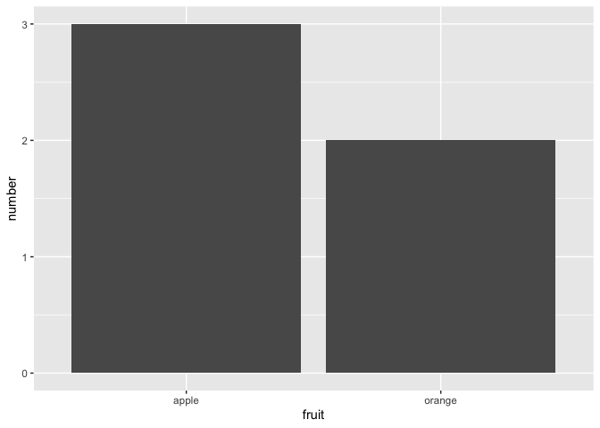
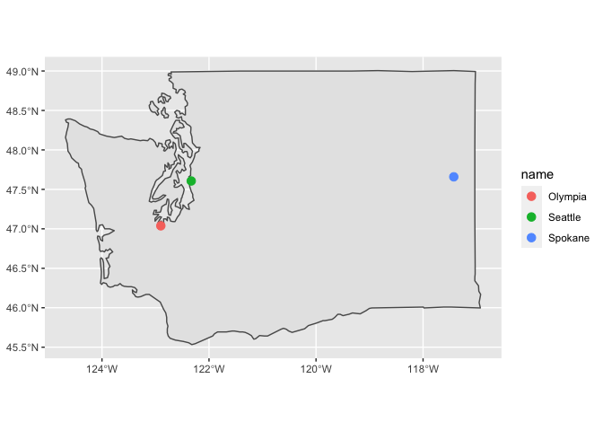

Samantha Remotigue PS07
================

# Welcome to Samantha’s Coverpage

------------------------------------------------------------------------

## During the fall semester, we made many different kinds of plots.

``` r
library(dplyr)
```

    ## 
    ## Attaching package: 'dplyr'

    ## The following objects are masked from 'package:stats':
    ## 
    ##     filter, lag

    ## The following objects are masked from 'package:base':
    ## 
    ##     intersect, setdiff, setequal, union

``` r
library(ggplot2)
```

## In practicing methods of making our own datasets and using ggplot, we began with simple barplots.

``` r
fruits <- tibble(
  fruit=c("apple", "apple", "orange", "apple", "orange")
)
fruits_counted <- tibble(
  fruit= c("apple","orange"),
  number=c(3,2)
)
```

``` r
ggplot(data=fruits_counted, mapping= aes(x=fruit, y=number))+ geom_col()
```

<!-- -->

## *More advanced visualizations*

*Two months later, we worked with map visualizations and cvs files, as
well as used ggplot2 to enhance our plots.*

``` r
library(tidyverse)
```

    ## ── Attaching packages ─────────────────────────────────────── tidyverse 1.3.1 ──

    ## ✓ tibble  3.1.4     ✓ purrr   0.3.4
    ## ✓ tidyr   1.1.3     ✓ stringr 1.4.0
    ## ✓ readr   2.0.2     ✓ forcats 0.5.1

    ## ── Conflicts ────────────────────────────────────────── tidyverse_conflicts() ──
    ## x dplyr::filter() masks stats::filter()
    ## x dplyr::lag()    masks stats::lag()

``` r
library(sf)
```

    ## Linking to GEOS 3.8.1, GDAL 3.2.1, PROJ 7.2.1

``` r
library(maps)
```

    ## 
    ## Attaching package: 'maps'

    ## The following object is masked from 'package:purrr':
    ## 
    ##     map

``` r
library(USAboundaries)
library(readr)
library(dplyr)
library(tmaptools)
```

    ## Registered S3 methods overwritten by 'stars':
    ##   method             from
    ##   st_bbox.SpatRaster sf  
    ##   st_crs.SpatRaster  sf

\*\* Washington Plot\*\*

``` r
WA_cities <- tibble(
  name=c("Seattle", "Olympia","Spokane"),
  lat=c(47.6062,47.0379,47.6588),
  lon=c(-122.3321,-122.9007,-117.4260)
)
WA_cities_sf<- WA_cities %>% 
  st_as_sf(coords=c("lon","lat"),crs=4326)

USA_map <-  maps::map("state", plot = FALSE, fill = TRUE)
USA_sf <- USA_map %>% 
  st_as_sf(crs = 4326)

WA_sf<- USA_sf %>% 
  filter(ID=="washington")

ggplot()+
  geom_sf(data=WA_sf)+
  geom_sf(data=WA_cities_sf, aes(col=name), size=3)
```

<!-- -->
